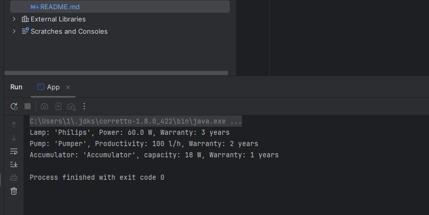

## Настройка проекта

1. **Создайте класс ConfigWriter для создания конфигурационого файла для подключения к базе данных:**
    - Скопируйте `src/main/java/itstep/learning/fs/ConfigWriterTemplate.java` в `ConfigWriter.java`.
    - Поменяйте поля под свою базу данных.

